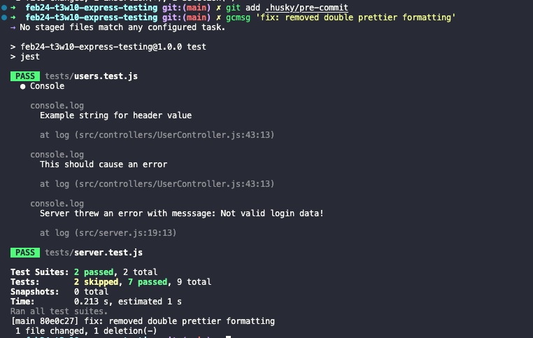

# Technical Study on Code Quality and Automation

## Overview

This repository serves as a technical study focused on the integration of testing, formatting, and linting tools in a Node.js environment. The goal is to explore how automated workflows can enhance code quality and maintainability in development.

## Key Technologies

-   Express Server: A basic server implemented using Express, providing the foundation for API-related experimentation.
-   Jest: Configured to run unit tests to ensure the correctness of the server code.
-   Prettier: Used to enforce a consistent code style across the project by automatically formatting code.
-   ESLint: Configured to identify potential issues and enforce coding standards, ensuring the codebase remains clean and maintainable.

## Automation

This study includes a focus on automation through Git hooks and continuous integration tools:

### Husky + lint-staged:

-   Husky: Automatically triggers Git hooks on commit.
-   lint-staged: Runs Prettier and ESLint only on staged files, ensuring that only committed changes are formatted and linted.
-   The hook process also includes running Jest tests to catch issues early in the development workflow.
    

### GitHub Actions

-   Configured to automatically run tests on a cloud-based Ubuntu image, simulating a CI/CD pipeline that ensures code quality before deployment.

## Study Objectives

This repository explores:

1. The impact of automated formatting and linting:
   By leveraging Prettier and ESLint, the study demonstrates how these tools can standardize code style and enforce best practices.
2. Test-driven development (TDD):
   With Jest integrated into the workflow, this study emphasizes the importance of testing as a foundation of reliable development.
3. Automation with Git hooks:
   By utilizing Husky and lint-staged, this project automates tasks such as running tests, formatting, and linting on every commit, thereby promoting continuous code quality enforcement.
4. Continuous Integration:
   Through GitHub Actions, the repository examines how cloud-based testing ensures code reliability across different environments.

## Conclusions

This repository illustrates how integrating tools like Prettier, ESLint, and Jest with automated workflows can streamline development and maintain high code quality standards. The project demonstrates how a disciplined approach to automation fosters cleaner, more reliable codebases
